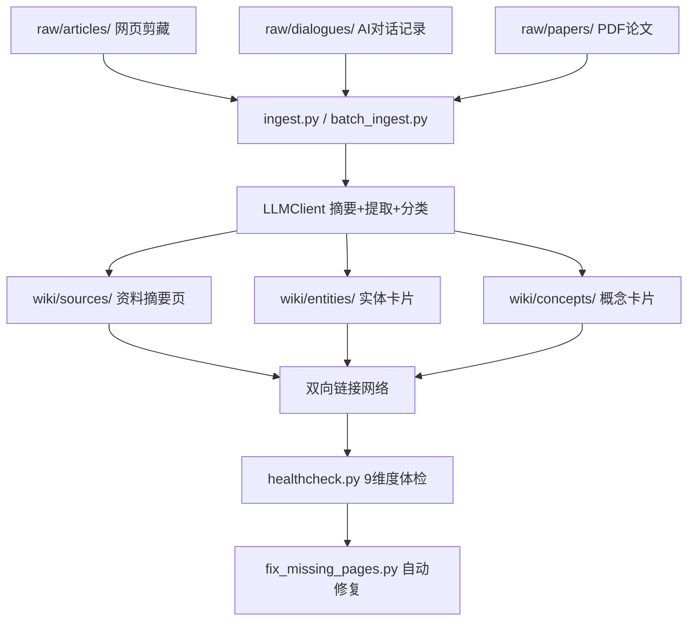

# LLM Wiki 🧠📚

[](https://www.python.org/downloads/)
[](LICENSE)
[](https://github.com/astral-sh/ruff)

> **将 AI 对话记录和阅读资料，自动编译为带双向链接的本地知识库。**

LLM Wiki 是一个参考Karpathy 的 LLM Wiki 思路，基于 Python 的本地知识库构建工具。它把 LLM 当作"编译器"——你负责输入原材料（对话记录、文章、PDF），LLM 负责提取实体、建立关联、格式化输出，最终生成一个可在 Obsidian / VS Code / 任何 Markdown 编辑器中浏览的结构化知识库。

```
Raw（原始资料） ──LLM 编译──> Wiki（结构化知识页） ──Health Check──> 持续维护
```

---

## ✨ 核心特性

| 特性 | 说明 |
|------|------|
| 🤖 **对话蒸馏** | 自动解析豆包、Kimi 等平台的对话导出格式，提取 QA、代码块、结论 |
| 🔗 **双向链接** | 自动识别 `[[实体]]` 和 `[[概念]]`，生成 Obsidian 风格的知识网络 |
| 🏥 **知识库体检** | 9 维度一致性检查（断链、孤立页、重复内容、图谱一致性），类似 CI/CD |
| 🏷️ **细粒度分类** | LLM 自动将实体分为 9 类（人物/公司/模型/算法/数据集...），概念分为 7 类 |
| 🚫 **智能去重** | 录入前自动检测重复资料，避免知识库膨胀 |
| 🔧 **一键修复** | 自动补齐断链 stub 页，健康评分从 74 → 87 只需一条命令 |
| 🌐 **多模型兼容** | 支持 Kimi(Moonshot)、Qwen(阿里)、OpenAI 三家 API，环境变量切换 |

---

## 🏗️ 架构



**三层架构设计：**

- **`raw/`** —— 原始层，只读、不可变。存放你的对话记录、文章、PDF。
- **`wiki/`** —— 知识层，LLM 自动生成和维护。双向链接、frontmatter、图谱数据都在这里。
- **`scripts/`** —— 工具层，你的"知识库编译器和 linter"。

---

## 🚀 Quick Start

### 1. 安装依赖

```bash
pip install -r requirements.txt
```

依赖仅 3 个：`openai`, `pyyaml`, `pdfplumber`。

### 2. 配置 LLM API

```bash
# 以阿里云 Qwen 为例
export LLM_PROVIDER=qwen
export LLM_API_KEY=your-dashscope-api-key

# 可选：指定模型（默认已配置）
export LLM_MODEL=qwen-plus
```

支持三种 provider：`kimi` | `qwen` | `openai`

### 3. 放入你的资料

```bash
# 对话记录（从 Kimi/豆包导出为 Markdown）
cp my-chat.md raw/dialogues/

# 普通文章
cp article.md raw/articles/
```

### 4. 一键编译

```bash
python wiki.py ingest
```

这会自动：
1. 调用 LLM 生成结构化摘要
2. 提取实体和概念，细粒度分类
3. 创建 source / entity / concept 页面
4. 建立双向链接
5. 更新索引和知识图谱

### 5. 体检与修复

```bash
python wiki.py health          # 运行 9 维度体检
python wiki.py fix             # 自动补齐缺失页面
python wiki.py health --fix-links   # 体检+自动修复断链
```

### 6. 查看知识库

用 [Obsidian](https://obsidian.md/)、VS Code + [Markdown Preview Enhanced](https://shd101wyy.github.io/markdown-preview-enhanced/)、或任何 Markdown 编辑器打开 `wiki/` 目录即可。

---

## 📸 效果预览

项目内置了完整的输入→输出示例，位于 [`examples/`](examples/) 目录：

| 输入（Raw 对话记录） | 输出（Source 蒸馏页） | 输出（Concept 卡片） |
|:---:|:---:|:---:|
| `examples/raw/dialogues/demo-rag-intro.md` | `examples/wiki/sources/demo-rag-intro.md` | `examples/wiki/concepts/rag.md` |

**示例内容**：一段关于 "RAG 检索增强生成" 的技术对话，经 LLM 蒸馏后生成：
- **Source 页**：提取核心问题、关键洞察、最终结论、涉及实体/概念
- **Concept 页**（RAG / Embedding）：含一句话定义、核心原理、应用场景、与其他概念的关系
- **Entity 页**（OpenAI / ChromaDB）：含基本信息、简介、核心产品、技术贡献、争议、关系网络

这些示例展示了 LLM Wiki 的**理想输出质量**——不是空壳 stub，而是有实质内容、可追溯来源的知识卡片。

> **提示**：`examples/` 中的 wiki 页面为手工编写的演示数据，用于展示项目能力。实际运行时，脚本会自动生成类似结构的页面。

---

## 🛠️ CLI 用法

```bash
# 统一入口 wiki.py
python wiki.py <command> [options]

# 常用命令
python wiki.py ingest                  # 增量录入新文件
python wiki.py ingest --force          # 全量重新录入（应用新的分类/去重逻辑）
python wiki.py ingest --type dialogue  # 只处理对话记录
python wiki.py health                  # 完整知识库体检
python wiki.py health --fix-links      # 体检并自动修复断链
python wiki.py query "Transformer"     # 搜索知识库
python wiki.py fix                     # 修复缺失的 wiki 页面
python wiki.py update --all            # 更新所有索引和依赖
python wiki.py rebuild                 # 一键全量重建（备份→清空→重新录入→修复→体检）
```

---

## 📁 项目结构

```
my-wiki/
├── raw/                          # 原始资料层（你的手稿，只读）
│   ├── articles/                 # 网页剪藏、博客文章
│   ├── dialogues/                # AI 对话记录（Kimi/豆包导出）
│   ├── papers/                   # 学术论文 PDF
│   └── _meta.json                # 原始资料元数据索引
│
├── wiki/                         # 知识层（LLM 自动生成）
│   ├── concepts/                 # 概念页（术语、方法、原理）
│   ├── entities/                 # 实体页（人物、公司、模型、论文）
│   ├── comparisons/              # 对比页（横向对比）
│   ├── sources/                  # 资料摘要页（raw 文件的蒸馏）
│   ├── index.md                  # 主页、目录树
│   ├── _log.md                   # 变更日志
│   ├── _graph.json               # 知识图谱数据
│   └── _dependencies.json        # 页面依赖关系
│
├── scripts/                      # 工具层（自动化脚本）
│   ├── llm_client.py             # 统一 LLM 客户端（Kimi/Qwen/OpenAI）
│   ├── ingest.py                 # 普通文章/PDF 录入
│   ├── ingest_dialogue.py        # 对话记录专用蒸馏
│   ├── batch_ingest.py           # 批量增量录入
│   ├── dedup.py                  # 去重检测与合并
│   ├── classify.py               # 实体分类与概念归类
│   ├── query.py                  # 智能查询引擎
│   ├── update.py                 # 级联更新与索引维护
│   ├── healthcheck.py            # 9 维度一致性体检
│   ├── fix_missing_pages.py      # 断链自动修复
│   └── utils.py                  # 公共工具库（YAML/链接/模板）
│
├── wiki.py                       # ⭐ 统一 CLI 入口
├── requirements.txt
├── pyproject.toml
├── LICENSE
├── README.md                     # 本文件
└── CLAUDE.md                     # Schema 规范（AI 操作手册）
```

---

## 🔬 健康检查：知识库的 CI/CD

```bash
$ python wiki.py health

🏥 LLM Wiki 健康检查
━━━━━━━━━━━━━━━━━━━━━━━━━━━━━━━━━━━━━━━━━━━━━━━━━━━━━━━━━━━━

✅ [1/9] Frontmatter 完整性检查
✅ [2/9] 断链检测
✅ [3/9] 孤立页面检测
✅ [4/9] 来源有效性验证
✅ [5/9] 标签规范化检查
✅ [6/9] 内容质量评估
✅ [7/9] 索引完整性检查
✅ [8/9] 知识图谱一致性
✅ [9/9] 重复内容检测

📊 统计:
   总页面数: 325
   健康评分: 87/100
   严重问题: 0
```

检查项详解：

| # | 检查项 | 作用 |
|---|--------|------|
| 1 | Frontmatter 完整性 | 确保每页都有 title/type/created 等必填字段 |
| 2 | 断链检测 | 扫描 `[[link]]` 是否指向不存在的页面 |
| 3 | 孤立页面检测 | 发现入度为 0 的页面（没有任何其他页面引用它） |
| 4 | 来源有效性 | 验证 `sources` 引用的 raw 文件是否真实存在 |
| 5 | 标签规范化 | 检测大小写/单复数不一致的标签 |
| 6 | 内容质量 | 评估字数、章节结构、空占位符比例 |
| 7 | 索引完整性 | 检查 index.md 是否收录了所有分类 |
| 8 | 图谱一致性 | 验证 `_graph.json` 的节点和边是否与实际文件一致 |
| 9 | 重复内容检测 | 用 n-gram fingerprint + Jaccard 相似度检测重复页面 |

---

## ⚙️ 高级配置

### 自定义分类体系

编辑 `scripts/llm_client.py` 中的 `extract_entities_and_concepts()` 方法，修改 system prompt 中的分类定义即可。例如增加 `framework` 实体类型或 `architecture` 概念类别。

### 调整去重敏感度

编辑 `scripts/dedup.py` 中的相似度阈值（默认 0.7），或调整 n-gram 大小：

```python
detector = DedupDetector(base_dir, similarity_threshold=0.8)
```

### 禁用 stub 定义自动生成

如果希望降低 API 成本，可在 `scripts/ingest.py` 中将 LLM 定义生成逻辑注释掉，回退到纯模板占位符。

---

## 🗺️ 路线图

- [x] 核心录入工作流（文章 / 对话 / PDF）
- [x] LLM 多模型兼容（Kimi / Qwen / OpenAI）
- [x] 细粒度实体/概念分类
- [x] 知识库体检（9 维度）
- [x] 断链自动修复
- [x] 去重检测
- [x] 统一 CLI 入口
- [ ] 向量语义搜索（ChromaDB / Ollama embedding）
- [ ] 静态站点导出（Quartz / VitePress 一键发布）
- [ ] Obsidian 插件版
- [ ] LLM 响应缓存层（降低 API 成本）
- [ ] SQLite 元数据库（替代文件 I/O）
- [ ] 页面安全重命名（Obsidian 式重构）

---

## 🤝 贡献

欢迎 Issue 和 PR！请先阅读 [CLAUDE.md](CLAUDE.md) 了解项目的 Schema 规范和架构设计。

开发前请确保代码通过编译：

```bash
python -m py_compile scripts/*.py
```

---

## 📄 License

[MIT](LICENSE)

---

> **写在最后**：这个项目探索的核心问题是——在 LLM 已经能帮我们理解和总结内容的时代，知识管理系统的边界应该在哪里？我们的实践结论是：LLM 承担 80% 的体力劳动（提取、分类、格式化、链接），人类保留 20% 的核心决策（Schema 设计、去重、质量审核）。
